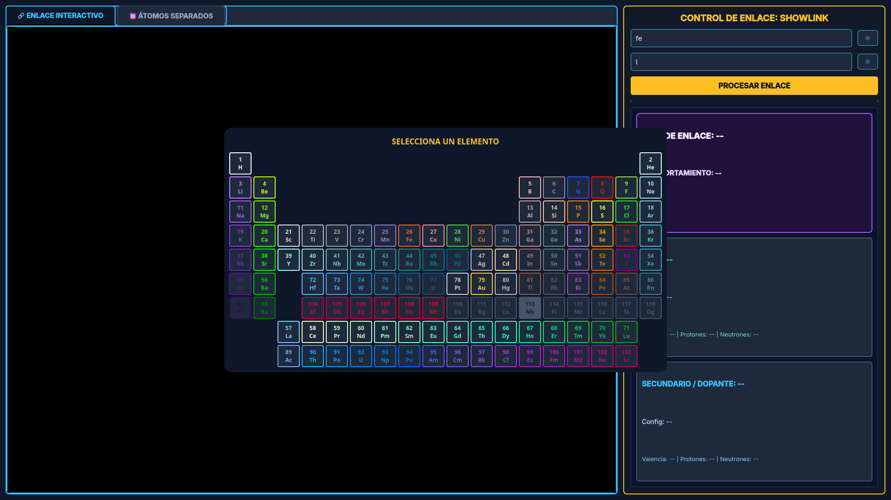
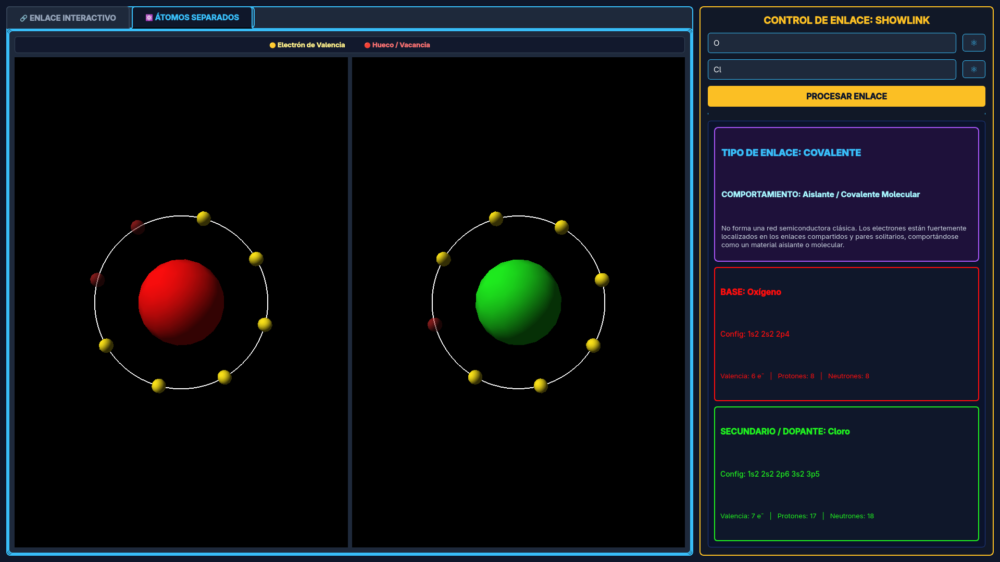
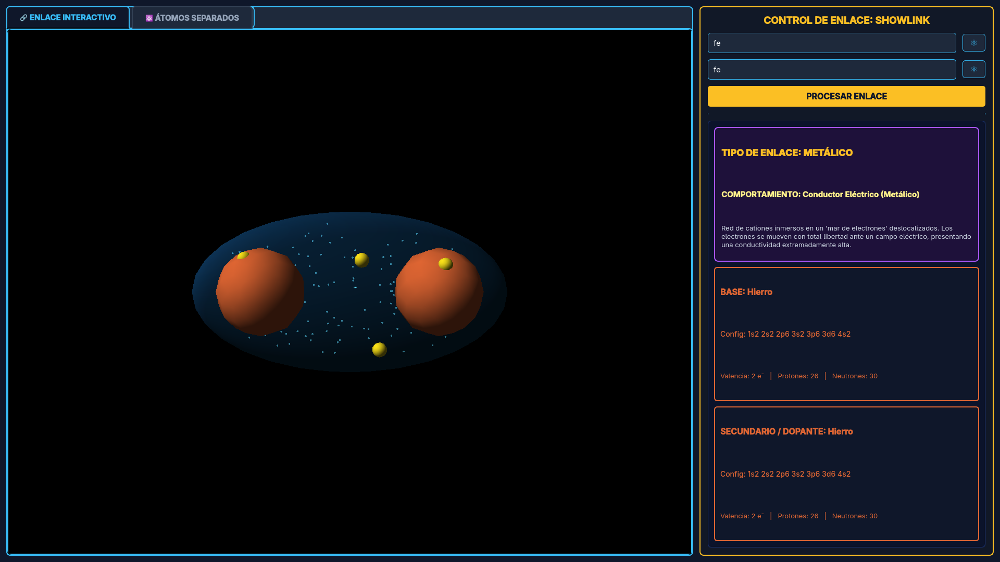
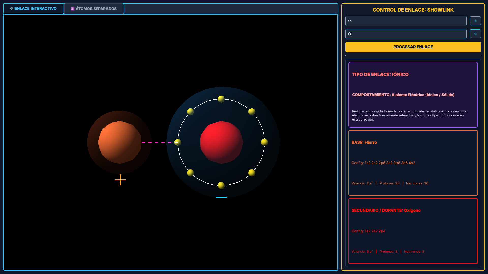
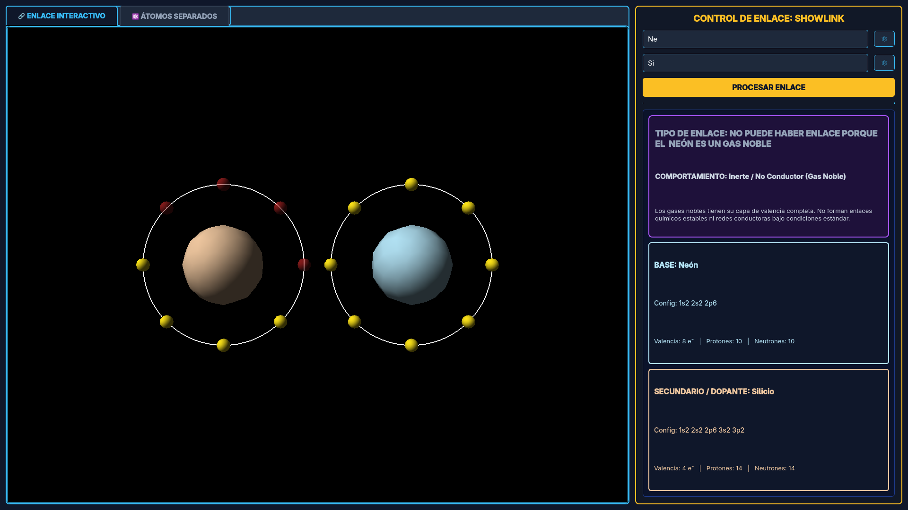
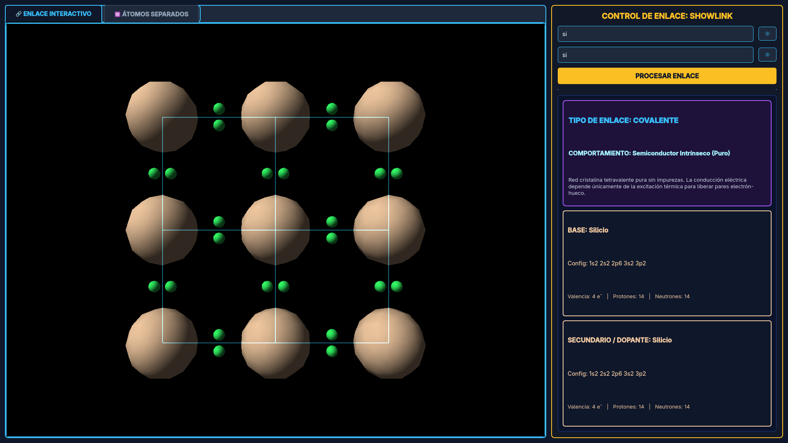
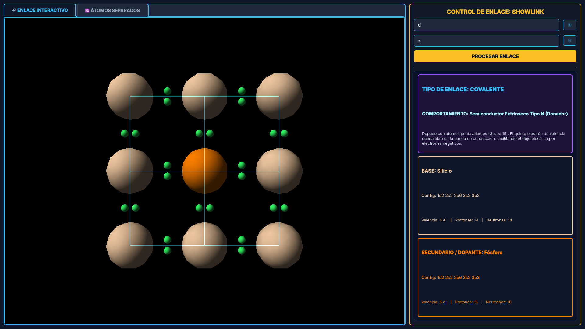
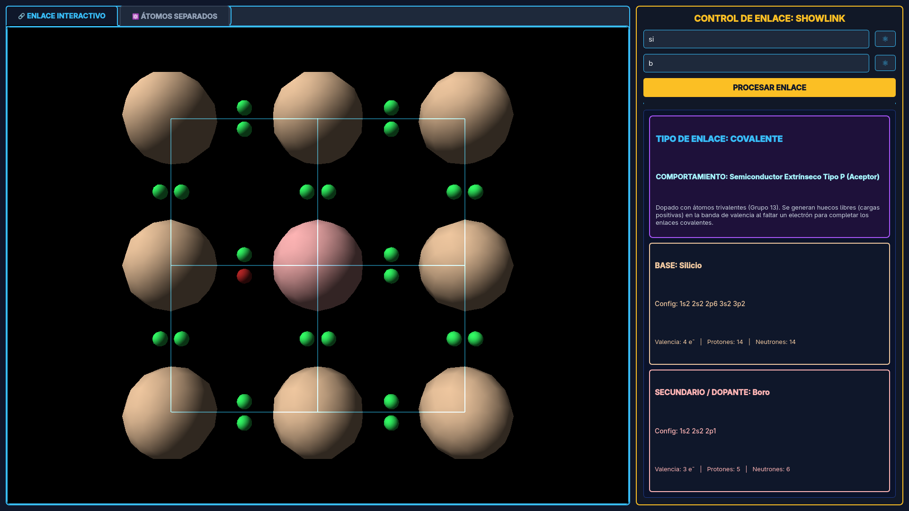

# ⚛️ ShowLink

**ShowLink** es una aplicación educativa de escritorio desarrollada en **Python**, **PyQt6** y **OpenGL (`pyqtgraph`)** diseñada para analizar, clasificar y visualizar enlaces químicos y dopajes semiconductores de forma interactiva en 3D.

El software calcula configuraciones electrónicas y proyecta cómo interactúan físicamente las capas de valencia mediante simulaciones y modelos tridimensionales.

---

## 📸 Demostración Visual

### 🧪 Interfaz y Vistas Atómicas

| Selección en Tabla Periódica | Átomos Separados e Inspección |
| :---: | :---: |
|  |  |
| *Selector modal interactivo de elementos.* | *Visualización de órbitas y capas de valencia.* |

---

### ⚡ Tipos de Enlaces Químicos

| Enlace Metálico | Enlace Iónico |
| :---: | :---: |
|  |  |
| *Mar de electrones deslocalizados y nube volumétrica.* | *Halos de transferencia electrónica y fuerza electrostática.* |

| Gases Nobles / Inerte |
| :---: |
|  |
| *Capas completas sin reacción química activa.* |

---

### 🔬 Redes y Semiconductores (Mallas 3×3)

| Intrínseco | Extrínseco Tipo N | Extrínseco Tipo P |
| :---: | :---: | :---: |
|  |  |  |
| *Malla cristalina pura tetravalente.* | *Dopaje con 5.º electrón libre conductor.* | *Dopaje aceptor con vacancia/hueco en la red.* |

---

## 🚀 Características del Proyecto

### 🧠 1. Backend Químico (`backend.py`)
* **Diagnóstico de enlace:** Clasificación automática entre dos elementos:
  * ⚪ Inerte / Sin enlace (Gases Nobles)
  * 🟡 Enlace Metálico (Conductores)
  * 🔴 Enlace Iónico (Transferencia electrónica)
  * 🔵 Enlace Covalente / Redes Semiconductoras (Intrínseco, Extrínseco Tipo N y Tipo P)
* **Cálculo atómico:**
  * Determinación de electrones de valencia y capacidad máxima (dueto/octeto).
  * Conteo exacto de protones, neutrones y masa atómica mediante `mendeleev`.
  * Asignación de paleta de colores por familia química.

### 🎨 2. Motor Gráfico 3D (`frontend.py`)
* **Vistas Atómicas Separadas:** Inspección individual de cada átomo con sus órbitas, electrones activos y huecos disponibles.
* **Enlace Metálico:** Nube volumétrica elipsoidal con simulación y rebote continuo del mar de electrones.
* **Enlace Iónico:** Representación de catión (+) y anión (-) con halos de carga, órbita receptora llena y vectores discontinuos de fuerza electrostática.
* **Enlace Covalente Molecular:** Traslape de orbitales con lente central compartida y pares de electrones enlazantes.
* **Semiconductores (Red 3×3):**
  * *Intrínseco:* Malla cristalina pura con enlaces covalentes completos.
  * *Extrínseco Tipo N:* Red con átomo dopante central y quinto electrón libre en movimiento.
  * *Extrínseco Tipo P:* Red con átomo aceptor central y vacancia/hueco en la estructura.

### 🖥️ 3. Interfaz de Usuario
* Tema oscuro estructurado en paneles divididos.
* Tabla Periódica interactiva completa en ventana modal.
* Control total de cámara OpenGL (rotación, traslación y zoom con el ratón).

---

## 📦 Instalación y Uso

### Opción 1: Ejecutables directos (Releases)
Descarga el binario para tu sistema operativo en la pestaña **Releases**:
* **Linux:** `ShowLink-Linux` (dar permisos con: `chmod +x ShowLink-Linux`)
* **Windows:** `ShowLink-Windows.exe`

### Opción 2: Correr desde el código fuente

1. Clonar el repositorio:
```bash
git clone [https://github.com/tu-usuario/ShowLink.git](https://github.com/tu-usuario/ShowLink.git)
cd ShowLink
```

2. Crear y activar entorno virtual:
```bash
python -m venv .venv
source .venv/bin/activate  # en Linux
.venv\Scripts\activate     # en Windows
```

3. Instalar librerías:
```bash
pip install -r requirements.txt
```

4. Ejecutar:
```bash
python frontend.py
```

---

## 🏗️ Estructura de Archivos

```text
ShowLink/
├── frontend.py          # Interfaz gráfica PyQt6 y renderizado OpenGL 3D
├── backend.py           # Lógica química, base de datos y clasificación de enlaces
├── requirements.txt     # Dependencias del entorno
├── SHOWLINK.png         # Icono oficial de la aplicación
├── screenshots/         # Galería de capturas de pantalla de la interfaz
└── README.md            # Documentación del proyecto
```

---

<div align="center">
  <p>Desarrollado con 💙 en <b>Python</b>, <b>PyQt6</b> y <b>OpenGL</b></p>
  <p><sub>ShowLink — Proyecto Educativo de Visualización Atómica 3D</sub></p>
  <p><sub>profe, si ve esto, ya, paro, exenteme XD</sub></p>
</div>